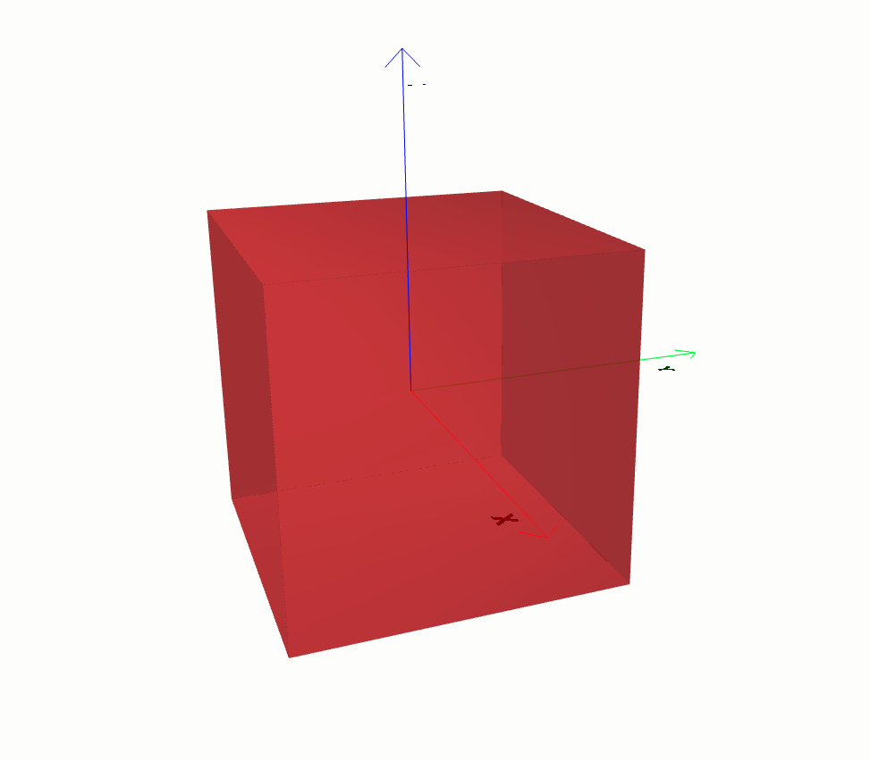

==================
Usefull operations
==================

Export to json file
*******************

You can export any design3d objects to a json file. To do so, you can just call the method ``save_to_file``.

Here is an example how you can save a plan face 3d to a .json file:

.. code-block:: python

    import design3d
    from design3d import surfaces, faces

    face = faces.PlaneFace3D.from_surface_rectangular_cut(surfaces.Plane3D(design3d.OXYZ), -1, 1, -1, 1)
    face.save_to_file('path/to/where/to/save/your/file.json')

Import from json file
*********************

If you have a json file containing design3d objects, you can use the method ``dessia_common.core.DessiaObect.from_json`` to import it.

Example:

.. code-block:: python

    import dessia_common

    design3d_object = dessia_common.core.DessiaObject.from_json('path/to/your/file.json')

Matplotlib plots
****************

To have a matplotlib visualization of a design3d object in 2D or 3D, you can call the ``plot`` method in any object. See the following example

.. plot::
    :include-source:
    :align: center

    import design3d
    from design3d import edges
    from design3d.core import EdgeStyle

    line_segment2d = edges.LineSegment2D(design3d.Point2D(1, 1), design3d.Point2D(-1, -2))
    line_segment2d.plot(edge_style=EdgeStyle('b'))

Model Visualization
*******************

To have a 3D visulaization of your model, most of the 3d objects has a babylonjs() method, which you can use to do so.
Babylon.js is an open-source, JavaScript framework and engine for creating and rendering 3D graphics and games in web browsers.
Here is an example on how you can do it.

.. code-block:: python

    import design3d
    from design3d import primitives3d

    block = primitives3d.Block(design3d.OXYZ, color=(1, 0.1, 0.1), alpha=0.6)
    block.babylonjs()

